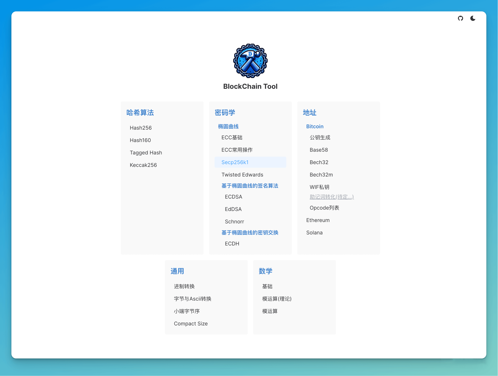
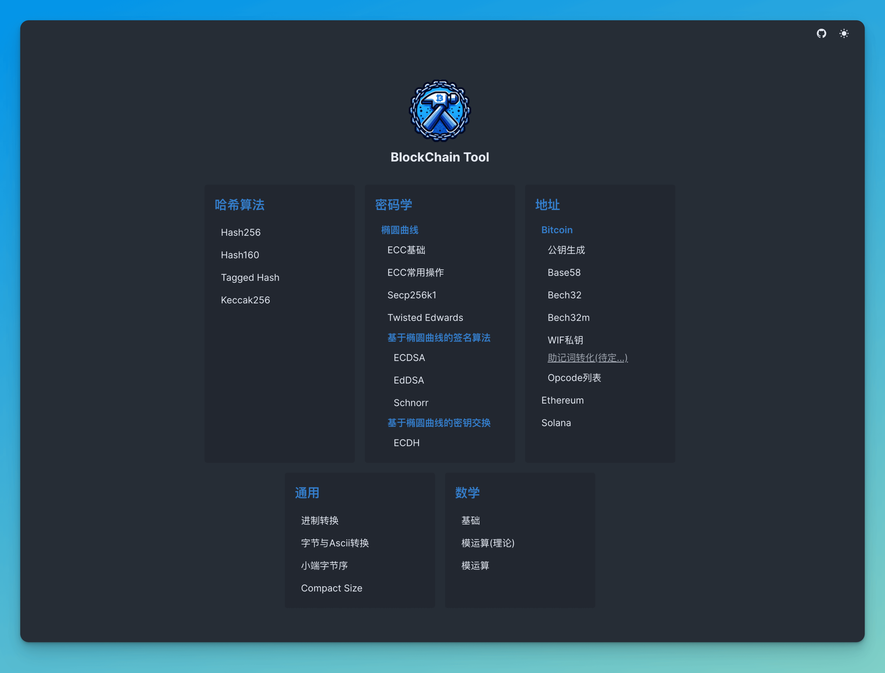
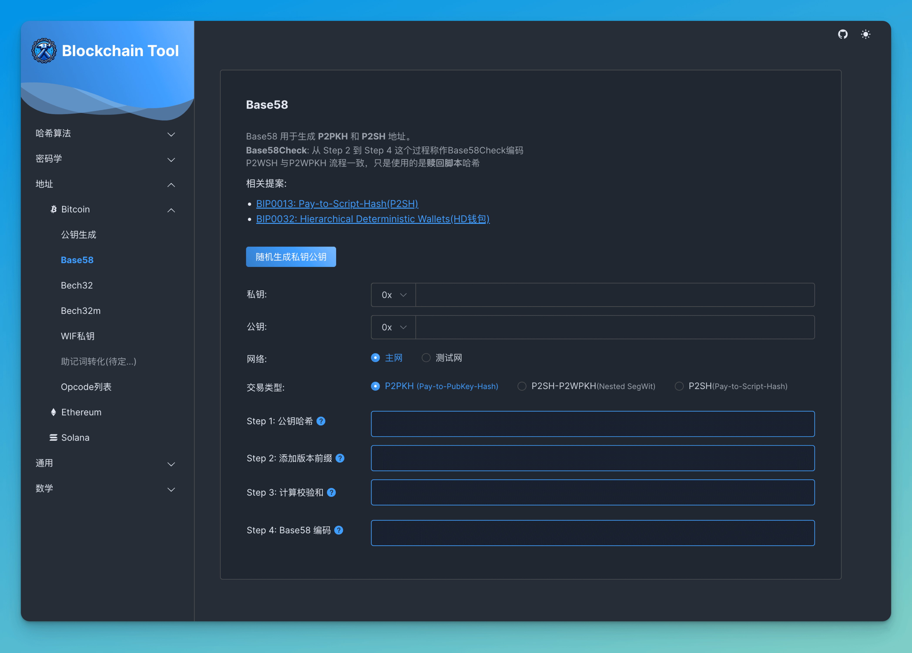
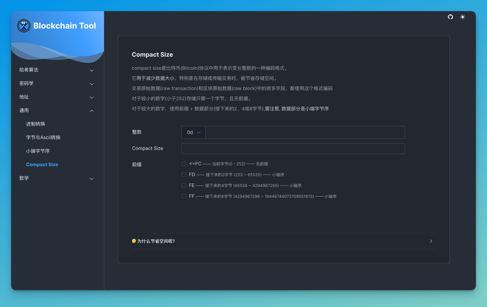

# Blockchain Tool


blockchain-tool 起源于我学习区块链的过程中，受到了[learnmeabitcoin](https://learnmeabitcoin.com/)  和
[ninja](https://bitcoin.heapup.tech/) 这两个非常优秀的比特币教程网站的启发。

它们提供了出色的交互工具，使学习更加直观。

为了更好地加深理解，我开始开发这个项目，在实践中强化对区块链技术的印象。 👉 [在线访问](https://blockchain-tool.vercel.app/)

> ps:学无止境, 边学边追加功能 (*≧▽≦)

## 本地运行

```bash
pnpm install
pnpm run dev
```

## 预览图










## 开发中遇到的问题和注意点

- [bn.js](https://github.com/indutny/bn.js) 和 [bignumber.js](https://github.com/MikeMcl/bignumber.js) 需要注意的是 bn不支持 浮点数，bignumber.js支持
- 椭圆曲线 [elliptic](https://github.com/indutny/elliptic) 和 [noble-curves](https://github.com/paulmillr/noble-curves) 两个椭圆曲线库，noble-curves比较符合区块链环境，常用的曲线都有
- 1字节2个16进制，有时候转化并不是简单的机制值转换，有时候需要按字节 不足1字节时可能需要补零
- 哈希算法中 按utf-8输入和 按16进制输入区别
